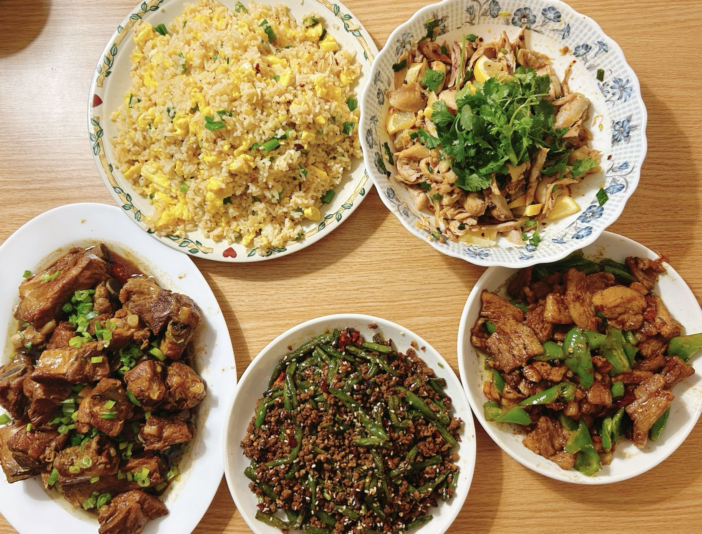
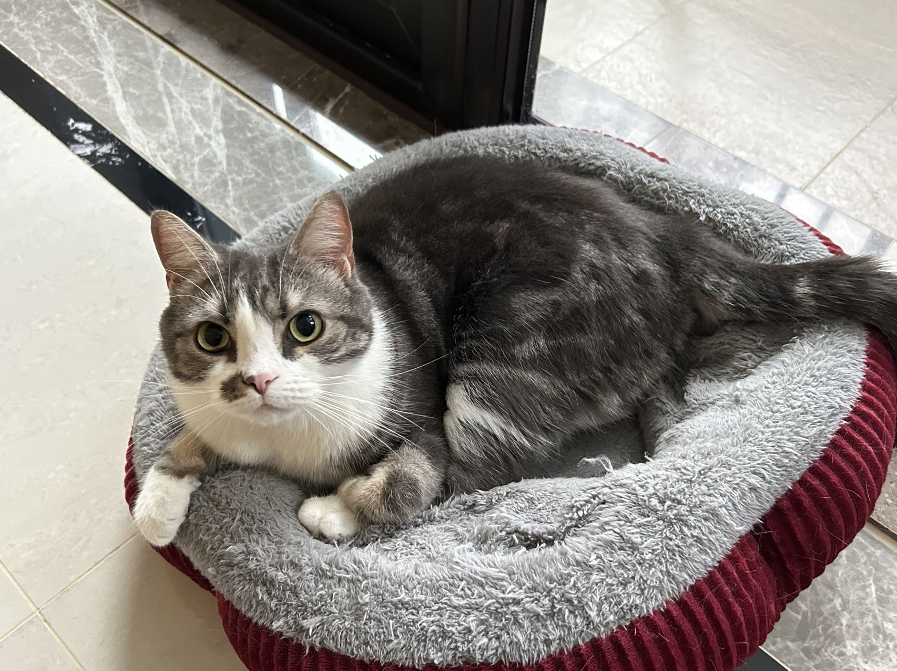

# Overview

My name is Chenyu Jin. I am a second year MPH Biostatistics student at Mailman. This is my virtual profile: a capybara. Welcome to my personal website and enjoy exploring here!

# About me

During my undergraduate study, I accumulated a great deal of knowledge in statistics, mathematics, economics, and finance. The outbreak of COVID-19 made me start to think about the future direction of my work, and it made me realize the impact that understanding and acquiring knowledge in the field of public health can have on a family, a country, and even the world as a whole.

As a result, I have decided to pursue Masters of Public Health in Biostatistics at Columbia University. I will aim to combine my knowledge of statistics with what I have learned in public health to address the challenges of health care in the world today.

In a world full of diversity, my interdisciplinary analytical skills enable me to tackle a variety of challenges in my studies and work. In the future, I will strive to become a multidisciplinary individual who is proficient in many fields.

If you would like to learn more about my experience, please visit [my resume](about.html).

# Published Paper

I am passionate about building various statistical models. In my undergraduate thesis, I constructed a trade gravity model to study the determinants of China's exports of metal manufactures, including the impact of COVID-19 on them.

Please visit [this page](pub.html) for details about this paper.

# Open Network

If you are interested in SAS programming, biostatistical methods, and statistical analysis, please feel free to connect me on [LinkedIn](https://www.linkedin.com/in/chenyu-jin-5815a828b/).

# Interesting Facts

*I enjoy cooking. Feel free to stop by for a taste, if you'd like.*

*I like playing the piano, here is my show picture.*

*This is my cat, Anderson. He is cute.*

