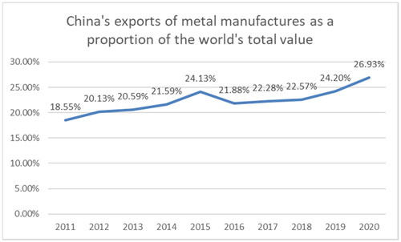

### Abstract

The year 2020 was the beginning of the Covid-19 pandemic, and the turning point for the industries poorly affected by the unexpected conditions. This paper focused on the impact of a range of factors on China’s exports of metal manufacture in 2020, in particular the impact of the COVID-19 pandemic on it. Using cross-sectional data, the paper collected relevant data for 151 countries in 2020. We applied trade gravity model by considering important parameters impacting on China’s exports of metal manufacture such as GDP, distance, population, the total number of cases of COVID-19, employment rate, economic degrees of freedom, the political environment and the free trade agreement between China and other countries. Then, by collecting the data set for 2021, this paper compares the models for 2020 and 2021 with the aim of making a comparison of the impact of the pandemic on China’s exports of metal manufactures. We also do some analysis about the trend of the effect of COVID-19 in the future. The paper continues with calculation of China’s export potential for metal manufacture for its 151 partner countries including 54 of them are at the Trade Potential Untapped level, 38 at the Trade Potential Growing level and 59 at the Trade Potential Mature level based on gravity model. This paper also offers different detailed trade policies for the distinct levels of trade potential in the light of the impact of the COVID-19.

### Full article

*Click [here](https://www.tandfonline.com/doi/full/10.1080/10971475.2024.2303793) to view full article.*

**Here, you can go back to [home](index.html) page.**